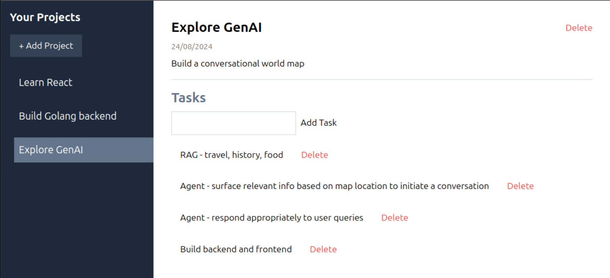

## Project Management

An app to practice React

To run locally, clone the repository and navigate to the project root directory. Run the following commands in the terminal (assuming npm is installed).

```bash
npm install
npm run dev
```

