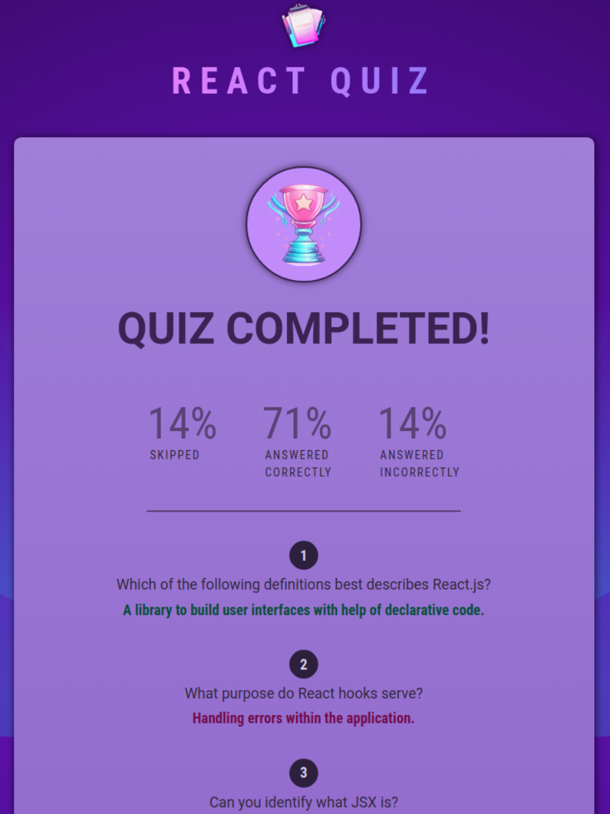

Quiz App

A practice app: timers, useEffect, handling side-effects, moving sate down

To run locally, clone the repository and navigate to the project root directory. Run the following commands in the terminal (assuming npm is installed).

```bash
npm install
npm run dev
```

