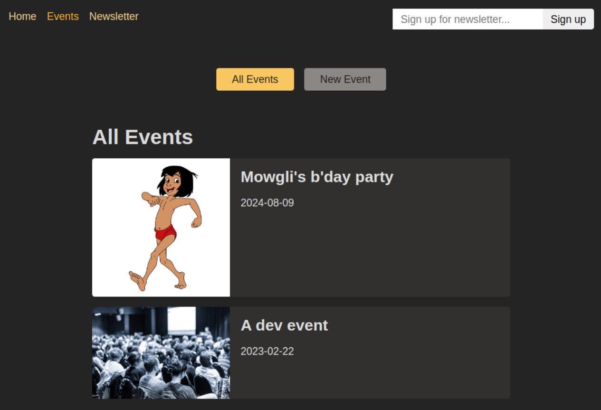

## Events - Single Page App

An app to practice using react router.

To run locally, clone the repository and navigate to the project root directory. 

Run the following commands in the terminal after navigating into `/frontend` (assuming npm is installed).

```bash
npm install
npm install react-router-dom
npm start
```

Run dummy backend in a separate terminal (assuming node is installed). Navigate to `/backend` from project root and run:

```bash
node app.js
```



### Notes
 
- When using `loader` inside `createBrowserRouter`, React Router executes the `loader` just before the corresponding root page is rendered (in our case, the `Events` page). Therefore if data is fetched from backend, there might be a slight delay before the `Events` page loads - complete with all data. Without using React Router, one would allow the UI elements to render first on screen and load data asynchronously.
    - One way of showing loading message: use `react-router-dom`'s `navigation.state` (`idle`, `loading`, `submitting`) to determine if we want to show the loading message. This should be done in a root component though like RootLayout in our case which is already rendered (not in the component which will use the asynchronously fetched data).
    - `navigate` and `navigation`, both part `react-router-dom` work differently. `navigate` helps programatically navigate to a different route (say, after an event).

- React Router `loader` cannot use hooks (useState, useEffect etc.) as they are not part of React components. But as they execute in the browser, they can use all other browser builtin functions (navigator, browser cache etc.)

- `useLoaderData()` should only be used when `loader` is directly provided at the `element` in `createBrowserRouter`. But if `loader` is provided at a parent level, use `useRouteLoaderData('route-id')` instead - where `'route-id'` is the `id` given to the parent `element`.

- `action` functions are often used to submit `Form` data to backend using react router. They are hooked to a route in `createBrowserRouter` and are automatically triggered when that route is active and when any `Form` displayed on that route is submitted. If any other action apart from the one belonging to the currently active path/route must be triggered, then the path/route for that action must be specified: `<Form method='post' action='any/other/path'>`.

- `useFetcher.Form` (also from `react-router-dom`) is used when one wants to trigger an action belonging to a different route (with `action="path/to/different/route"`). If we use the regular `Form` from `react-router-dom` and provide the custom `action` prop, there will be side-effect of submitting that form - the route to which the action belongs will be navigated to after the action! One may not want this behavior - for example, if there is a newsletter signup component at the top right of every page. Navigating automatically to the page/component housing `newsletterFormSubmit` action on form submission may not be the desired behavior.
